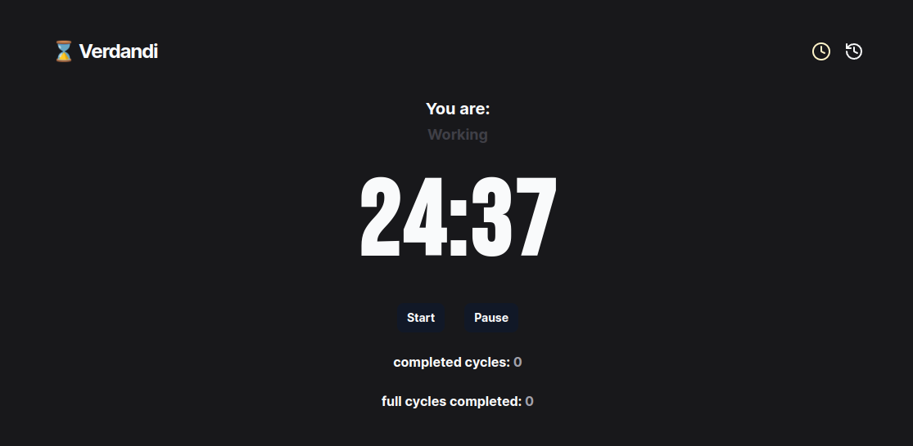

<h1 align="center">⌛ Verdandi</h1>

<br/>

## About

Verdandi is a pomodoro-like timer built with Svelte and Tailwind CSS.

<p align="center">
  
</p>


## Pomodoro
To learn more about the pomodoro technique click <a target="_blank" href="https://pt.wikipedia.org/wiki/T%C3%A9cnica_pomodoro">here</a>.


## Get Start

To run the application follow the steps about:

```
1- Clone the project

```sh
# Clone this project
$ git clone https://github.com/gustavosalviato/verdandi.git

# Access the folder on your terminal/cmd
$ cd verdandi

# Install the dependencies
$ npm install | yarn install | pnpm install

# run de application
$ npm run dev

# The application will start at port:5173 - access <http://localhost:5173>`
```

## 🚀 Tecnologies

This project was developed with the tecnologies about:

- Svelte
- Typescript
- Tailwind CSS

---

Made with 💜 by gustavosalviato :wave: [Make contact](https://www.linkedin.com/in/gustavo-salviato-910048212/)

